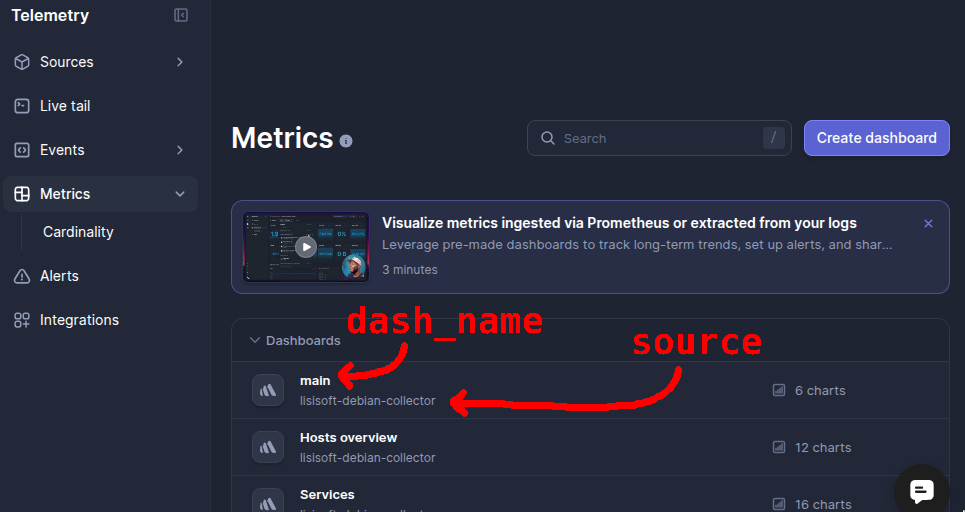
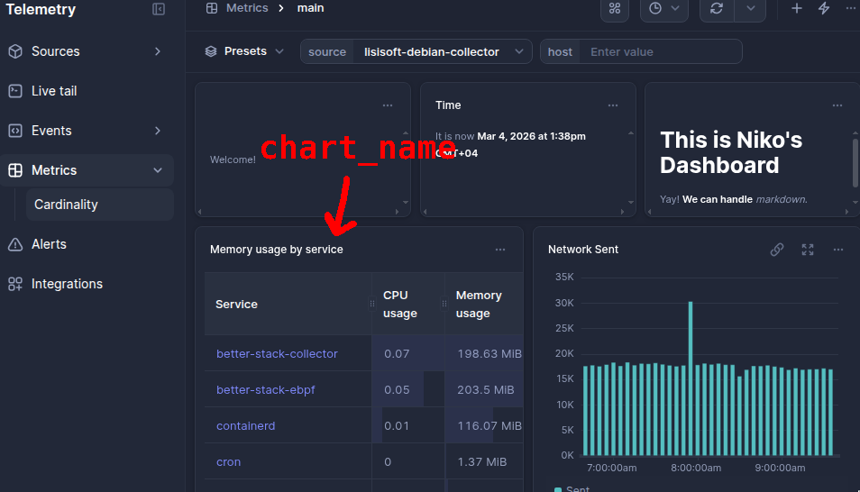

# bsdash
A small dashboard TUI for BetterStack table charts made in ~11 hours.

Here is the full programming stream where I show how I made this live: [BetterStack Dashboard TUI Programming Stream](https://youtube.com/live/2lS-ACvrxgc?feature=share)

Look at STREAM.md for more notes.

```
Usage: bsdash [options]
    -C, --session-cookie COOKIE      Save session cookie and exit
    -t, --auth-token TOKEN           Auth token
    -r, --refresh-interval SECS      Refresh interval (seconds)
    -s, --source NAME                Source name
    -d, --dashboard NAME             Dashboard name
    -c, --chart NAME                 Chart name
    
Keys:
    q    Quit bsdash
    r    Force refresh (also pulls query/setting changes)
```

## Setup

Requires ruby, bundle and a BetterStack account and API key.

- `cd src`
- `bundle install`
- Obtain BetterStack session cookie
  - Log into betterstack
  - Go into DevTools > Application > Cookies and find `_session`
  - Double-click the value tothe right of `_session` and copy it
- Run `bsdash --session-cookie/-C <cookie>` to cache the session cookie
  (it will expire in ~3 months)
- Run `bsdash -t <auth_token> -s <source> -d <dash_name> -c <chart_name>` to begin.

  Refer to the images to find each field:
  
  
  
  So, in my case, I would do:
  ```
  bsdash -t my_auth_token -s lisisoft-debian-collector -d main -c "Memory usage by service"
  ```
  
- All flags and settings will get cached to `~/.config/bsdash/`, so you can just run `bsdash` with no flags to start monitoring the same chart.

- Want to view a different chart in the same dashboard? Only specify the chart name.
  ```
  bsdash -c 'My new chart'
  ```
  Everything else was already cached, so you only need to specify what changed.

- Session cookie expired? (Will happen every 3 months!) Just grab a new session cookie from your browser and save it in bsdash:
  ```
  bsdash -C session_cookie   # will exit saying cookie was set
  ```
  Then running `bsdash` will get you back to where you left off.

### Caveats
- This is a demo, so it only works with table charts.
- Won't work for projects that have duplicate dashboard names or duplicate chart
  names as both are used to identify them.

## How It Works

1. First we need the session cookie and the auth token to be set.

2. Then we obtain a jwt token (and keep re-obtaining it time-to-time)
```
GET https://telemetry.betterstack.com/team/t<team_id>/tail/cloud-jwt-token
Cookie: <session_cookie>
```

3. Then we need the source to be set using `-s/--source lisisoft-debian-collector`

4. Fetch sources and find one with the `.name` as `<source_name>` (specified with `-s` flag).
   We obtain `team_id`, `table_name` and `data_region`.

5. Fetch specified dashboard
```
curl --request GET   --url "https://telemetry.betterstack.com/api/v2/dashboards"   --header "Authorization: Bearer <auth_token>"
```

6. Fetch dashboard config to get charts and their queries
```
curl --request GET   --url "https://telemetry.betterstack.com/api/v2/dashboards/693277/export"   --header "Authorization: Bearer <auth_token>"
```

7. Fetch realtime data from dashboard using query from specified chart
```
POST `https://<data_region>-connect.betterstackdata.com/?table=t<team_id>.<table_name>&defer-errors=true&range-from=x&range-to=y&sampling=1`
Authorization: Bearer <jwt_token>

<chart_query>
```

8. Keep fetching new data and merging with existing data on each refresh
   (automatic interval or 'r' key press)

9. Rerender on data refresh or window resize

## License
MIT
